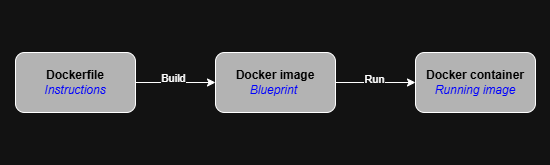

# Docker and GitHub Actions

Learning Docker and GitHub actions workflows. Build and deploy Docker containers to Docker Hub using CI/CD workflows.

## Docker

Terminology

- Dockerfile
- Image
- Container
- Docker Hub
- Docker deamon

### Running a container in interactive shell

Every command starts with `docker`. For instance, if you want to start a container from an imange you run this command `docker run <image-name>`. By default, docker starts an image and shows you the output while it is running. Some images do now show any output, like the Ubuntu image, so it makes sense to run them on the interactive shell. To do this, we specify the `-it` flag. To do this with the Ubuntu image we run this command `docker run -it ubuntu`. To exit a container or its interactive shell, we simply use the `exit` command.

### Running a container in detached mode

To run a container in detached mode, you do not get any output nor the interactive shell. To do this you specify the `-d` flag. This mode is useful for databases, vector database. If you want to run the **PostgreSQL** in detached mode you can run this command `docker run -d postgres`. This will return a string of characters which are represent the ID of the container. Also, to stop a container, you can write the command `docker stop`. A stopped container is not fully gone, it is eating up some memory and resources. We can remove the container altogether by using the `rm` command using this syntax; `docker container rm <container-id>`.

To get a list of all running containers we can run `docker ps`. When there are a few containers to work with, it will be much easy to work with the given IDs but if you have too many containters you can use the `--name` flag to specify a reasonable, human-friendly name for each container. The syntax for this is `docker run --name <container-name> <image-name>`. Here, `<container-name>` is the human-readable name you want to use while `<image-name>` is the name of the image you want to run as a container. This allows you to easily find your images. You can filter images by name when running `docker ps` to get a list of all images that match the given name using `docker ps -f "name=<container-name>"`

To look at the output generated by the container you can use `docker logs <container-id>`. If you want to follow these logs in real-time you can use `docker logs -f <container-id>`.

### Pulling images on Docker Hub

There are thousands of ready-to-use images hosted in Docker Hub and all you have to do is download and use them. Downloading and image is called pulling an image and `docker pull <image-name>` can help you. This allows you to find the latest version of the image since you did not specify any specific version. It is advisable to get a specific version using `docker pull <image-name>:<version>` such as `docker pull ubuntu:22.04`. To confirm if an image has been downloaded to you system, you can confirm with `docker images` which lists all the images available images in the system. It also gives us information about the size, when it was created, its ID, and its tag. If you want to remove a specific image you can use `docker image rm <image-name>`

It is possible to have multiple containers based on the same image and this makes it very difficult to delete them one-by-one. A better workaround is to use `docker container prune`. This command removes all stopped containers, i.e., not running. We can use `docker image prune -a` to remove all unused images. By unused images we mean images which do not have a container associated with it. Here the `-a` flag makes it so that we remove all unused containers not only dangling images. A dangling image is an image which no longer has a name, its name is `<none>`, because the name has been reused for another image.

### Pushing Images to Docker Hub

To distribute images with the community or specific people, you need to upload them to Docker Hub which in a central repository where it can be found. A repository can either be public or private. To push an image we use the command `docker image push <image-name>`. To push an image to a specific registry, we have to make sure that the `<image-name>` starts with the registry we want to push to. We can do this by renaming the image to with a Docker tag. For example, say we want to push an image host a machine learning model, called model and it is version one, we can use `docker tag model:v1 dockerhub.myprivateregistry.com/model:v1`. From here we can then push the image using `docker image push dockerhub.myprivateregistry.com/model:v1`.

The registry we are pushing to might require authentication and the credentials can be provided using `docker login dockerhub.myprivateregistry.com`. The URL we authenticate for should be the same as the one we intend to push the image to.

We can also send the image as a file using `docker save -o image.tar model:v1`. To load the file we use `docker load -i image.tar`

### Creating your own Images and Containers

To create a container, we first have to write a series of instructions in a Docker file. These instructions are the same as the ones you would run but adding some docker specific syntax on them. Conveniently, this file should be called **Dockerfile** for docker to be able to find it. Docker runs these commands, in the file, from top to bottom.

- A Dockerfile always starts from another image, called _base image_. The base image is specified using the `FROM` instruction. As mentioned, it is always a good practice to _specify versions_, you can specify the version of the base image as well.
- To create an image from the docker file we use the `build` command, specifying the path to the file. `docker build .`. Here, the period specifies that the Dockerfile is in the same path as where you are running the command from. At this stage, docker will give a _SHA256_ value as an ID of this image but you can specify a human-friendly name to work with using the tag flag, `-t` such as `docker build -t model:v1 .`.
- To customize the instruction to run when running the container we use the `RUN <valid-shell-command>` instruction. The Docker file can include more than one of these instructions as demonstrated in the snippet below. The snippet starts from the `ubuntu` base image, updates all packages, and then installs Python3 giving the `-y` flag since once the image starts building it is impossible to give further input.
- Sometimes you may need to add some files or folders from you local machine to the image. The COPY command enables this. The COPY command takes two important arguments which are the path of the folder on the local machine and the destination in the image. If the destination path does not have, the orignal filename is used. Also, if you don't specify the filename, the entire contents of the folder will be copied to the destination folder. It is not possible to copy files in the parent directory.
- Your image does not only have access to files and folders in your local system but it can also have access stored in remote computers which you can download. To download a file, execute this command `RUN curl <file-url> -o <destination>`. If this is a zip file, you then need to unzip it using `RUN unzip <dest-folder>/<filename>.zip`. To aviod consuming space with the original zip file, you need to remove it using the command `RUN rm <destination-filename>.zip`. Each instruction that downloads files adds to the total size of the image, even if the files are deleted in a later stage. To solution is to download, unpack, and delete files in a single instruction which can be done by combining commands using double ampersand which means that in order to continue to the next instruction, the previous one should have been successfully executed. A slash is used to separate these commands into multiple lines, ensuring readability. All changes made in a single instruction make one layer.
- Typically, when you run your docker container you want a specific command to run (i.e., start command). The `CMD` command takes one parameter which is the command you want to run. Imagine you intend to run a FastAPI application, this is where you will have the command that runs it. This command does not increase the image size and does not add any second to the build. It is important to note that if multiple instructions exists in a Dockerfile, only the last one will have an effect. While this command sets a default run command, this command can be overriden by starting the container with a custom instruction such as `docker run <image> <custom-instruction>`. Also, you can start this image in interactive mode although it has a start command `docker run <image> <shell-command>`. For instance, you can start with bash so that you can see what is in the image using `docker run -it <image> bash`.

```bash
FROM ubuntu
RUN apt-get update
RUN mkdir /app/
WORKDIR /app/
COPY /home/script.sh /app/

RUN useradd -m brian

RUN curl <filename.zip> -o <destination.zip> \
&& unzip <destination.zip> -d <unzipped-directory> \
&& rm <desination.zip>

USER brian
CMD ./script.sh
```

The relationship between a Dockerfile, docker image, and a docker container is shown in the figure that follow.



### Docker Caching

Depending on how large the copies and how long the execution of the instructions take, the first build typically takes longer. By default, consecutive builds are much faster because Docker re-uses layers that haven't changed. A layer is reused if the instructions are exactly the same and all previous docker file instructions are also identical. In simple terms, if all the previous layers are not changed and the current one contains the same instruction, the layer is not changed. If you do not want this behaviour, you can use teh `--no-cache` flag when building the image. Having an understanding on which layers changes most frequent, allows you to layer your instructions in the docker file such that you optimize the build time. As a simple advice, always put the instructions to install stuff just before copying file or use multi-stage builds which allows you to copy only what's necessary to perform installations on the first stage and making the installtions and the take, from the first build, only what is necessary and then copy everything on the last stage.

### Docker Instruction Interaction

The FROM, RUN, and COPY instructions only interact through the file system. However, some instructions have direct influences on other instructions. The WORKDIR changes the working directory for the following instructions, USER changes the user for the following instructions. To use another user, in contrast to the root user in Linux, you need to first create the user and the command `RUN useradd -m <username>` can help you attain this. You can then user `USER <username>` to set that user for the upcoming instructions.

### Variables in Docker

The ARG instruction allows us to set variables inside a docker file and then use it throughout the docker file. To create a variable, the syntax is `ARG <name>=<path>` and to use it the syntax is `$name`. To set an ARG variable during the Docker build process, you need to use the `--build-arg` flag when running the docker build command. `docker build --build-arg <var_name>=<value> -t <image> .`.

The second way to descrive variable using the ENV instruction. Unlike variables set using ARG, these kind of variables are accessible even after the image has been created. The syntax is `ENV <name>=<value>`. Note that it is possible to override ENV variables when starting a container using the syntax `docker run --env name=new_value <image>`. However, this approach is not secure because anyone you share the image with can easily use the docker history command to retrieve the list of shell commands executed by you and they can find the secrets you have been passing with the ENV variables.

## Creating Secure Docker Images

The first step in creating a secure container is choosing the right base image. Secondly, only install the software you need since adding unnecessary packages and software reduces the security of the image. Third, do not run applications as a root user but instead create users with minimal permission, enough to complete their jobs, and use them and that is because the root user has permission to access everything in the system so attackers can easily elevate privileges and the surface of an attack. Also, when copying files, avoid copying entire folders because a malicious script can be added to the folder and you do not intend to include it but copying everything automatically brings a threat into production.
