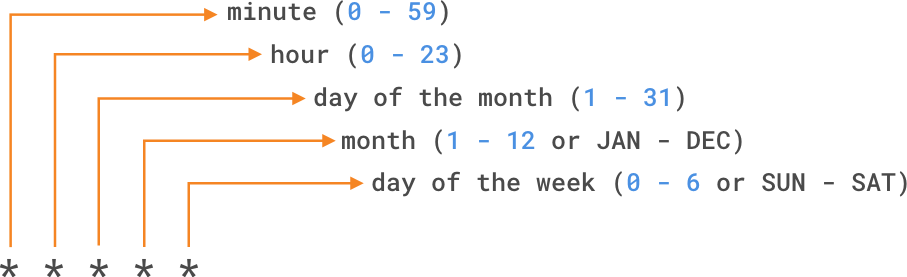

# GitHub Actions, Docker, CI/CD, Amazon EKS

**GitHub Actions** is a Infrastructure as a Service that is offered by _GitHub_ to help the delivery and deployment of code easy and integrate with GitHub where you write code. Each repository in GitHub has an Actions tab which is where you can configure workflows and manage actions. GitHub Actions are scripts that adhere to a yaml data format. From the Actions tab, you can use templates by clicking on the Configure button to add the script and begin editing the source yml.

Aside from the templates, you can either write yaml files from scratch, buy from market place, or reuse some that you already have or are open-source.

## Types of GitHub Actions

1. **_Container Actions_**. Here, the environment is part of the action's code and these actions can only be run in the Linux enviroment that GitHub hosts. Container Actions support many different languages.

2. **_JavaScript Actions_** don't include the enviroment in the code. You have to specify the environmet to execute these actions. You can run these actions in a virtual machine in the cloud or on-premise. JavaScript Actions support Linux, macOS, and Windows enviroments.

3. **_Composite Actions_** allows you to combine multiple workflows steps within one action. For example, you can use this feature to bundle together multiple run commands into an action and hten have a workflow that executes the bundled commmands as a single step in that action.

### The Components of a GitHub Action

```yaml
name: 'ci/cd'
author: Brian Msane
on:
    push:
        branches:
            - dev
            - main
            - uat
jobs:v
    running:
        runs-on: ubuntu-latest
        steps:
            uses: actions/checkout@v4
            uses: actions/setup-python@v3
            run: python main.py
```

Above we shows a sample workflow for a GitHub Action. The components of GitHub actions can be visualized as the following image. There are several components that work togetehr to run tasks within a workflow. In short, an event triggers the workflow, which contains a job. This job then uses steps to indicate which actions will run within the workflow.


Source: [Microsoft Learn](https://learn.microsoft.com/en-us/training/modules/github-actions-automate-tasks/2b-identify-components-workflow)

## Workflows

A GitHub workflow is a process that you can set up in your repository to automate software development lifecycle tasks. A workflow needs to have at least on job, and different events can trigger it. With a workflow, you can build, test, package, release, and deploy any project on GitHub. To create a workflow, you need to have the followin.

- Make a `.github/workflows` directory at the root of your repository
- Create a `.yaml` file to store your commands in
- Inside the file, put commands. Follow the anatomy above, you can refer to the [documentation here](https://docs.github.com/en/actions/reference).

### Attributes

- `name`; the name of the action
- `on`; its value is a trigger to specify when this workflow runs. You can specify:
  - single evens like `on: push`,
  - an array of events like `on: [push, pull_request]`,
  - or event configuration map that schedules a workflow or restricts the execution of a workflow to specific files, tags, or branches. The map might look like this.
- `runs-on`; specifies the runner in which a particular job is to run.

  ```yaml
  on:
  push:
    branches:
      - main
  pull_request:
    branches:
      - main
  page_build:
  release:
    types:
      - created
  ```

In this map, the workflow will run on a push or pull_request to the main branch, on page_build, and release.

### Jobs

A workflow must have at least on job. A job is a section of the workflow associated with a runner. A runner can be GitHub-hosted or self-hosted, and the job can run on a machine or in a container. You specify the runner using the `runs-on` attribute. In the anatomy above, the job runs on `ubuntu-latest`. Each job has steps to complete. The actions inside your workflow are the standalone commands that are executed. In our example above, we have three steps which are

```yml
uses: actions/checkout@v4
uses: actions/setup-python@v3
run: python main.py
```

### Referencing Actions in Workflows

You can reference actions from various sources to automate tasks within your workflow. The primary sources are:

1. A Published Docker Container Image on Docker Hub

Workflows can reference actions that are published as Docker containers images on Docker Hub. These actions are containerized and include all dependencies required to execute the action. To use such an action, yo can specify the Docker image in the `uses` attriute of your workflow. For example

```yaml
steps:
    - name: Run a PostgresSQL Container
      uses: docker://<docker-image-name>:latest
```

2. Public Repository

Actions hosted in public repositories can be directly referenced in your workflows. These actions are accessible to anyone and can be used by specifying the repository name and version in the `uses` attribute. For security reasons, it is recommended to use a full commit SHA when referencing such actions to ensure that your workflow always uses the same code.

For example

```yaml
steps:
  - name: Copy code to runner
    uses: actions/checkout@v3
```

Here, we are using an action called checkout and the version is v3. It is found in the actions repository.

3. The same repository as your workflow file

You can reference actions stored in the same repo as your workflow file. This feature allows you to build custom actions that you want to reference in your actions. To reference them, you can use a relative path to the action's directory.

```yaml
steps:
  - name: Use a local action
    uses: ./path-to-action
```

4. An enterprise marketplace

If your organization uses GitHub Enterprise, you can reference actions from your enterprise's private marketplace. These actions are cureated and managed by your organization, ensuring compliance with internal standards.

## GitHub-hosted versus self-hosted runners

A runner is simply a server that has the GitHub Actions runner application installed. If you use GitHub-hosted runner, each job runs in a fresh instance of a virtual enviroment. The GitHub-hosted runner type you define on runs-on as the operating system and version specifies the environmet. With self-hosted runners, you need to apply the self hosted label, its operating system, and the system architecture. For exmaple, `runs-on: [self-hosted, linux, ARM32]`.

## Configuring workflows

### Run for scheduled events

You can configure your workflow to run when specifi activity occurs on GitHub, when an event outside GitHub happens, or at a scheduled time. The `schedule` event allows you to trigger a workflow to run at specific UTC times using POSIX cron syntax. This cron syntax has five `*` fields and each represent a unit of time as shown in the image.



Source: [Microsoft Learn](https://learn.microsoft.com/en-us/training/modules/github-actions-automate-tasks/2c-configure-github-actions-workflow)

For example, if you want to run a workflow every 15 minue, the schedule event would look like the following.

```yaml
on:
    schedule:
        - cron: '*/15 * * * * *'
```

Also, if you wanted to run once a year on the 24th of January at 2 am 🎂 you could configure it like this.

```yaml
on:
    schedule:
        - cron: '0 2 24 1 *'
```

### Run manually

Using `workflow_dispatch` you can manually trigger. This event allows you to run the workflow using the GitHub REST API or by selecting the Run workflow button in the Actions tab within your repository on GitHub.

```yaml
on:
  workflow_dispatch:
    inputs:
      logLevel:
        description: 'Log level'     
        required: true
        default: 'warning'
      tags:
        description: 'Test scenario tags'
```

In addition to workflow_dispatch, you can use the GitHub API to trigger a webhoot event called repository_dispatch. This event allows you to trigger a workflow for activity that occurs outside of GitHub. It essentially serves as an HTTP request to your repository asking GitHub to trigger a workflow of an action or webhook. Using this manual event requires you to do two things; send a POST request to the GitHub endpoint `/repos/{owner}/{repo}/dispatches` with the webhook event name in the request body, and configure your workflow to use the repositor_dispatch event.

```bash
curl \
  -X POST \
  -H "Accept: application/vnd.github.v3+json" \
  https://api.github.com/repos/octocat/hello-world/dispatches \
  -d '{"event_type":"event_type"}'
```
